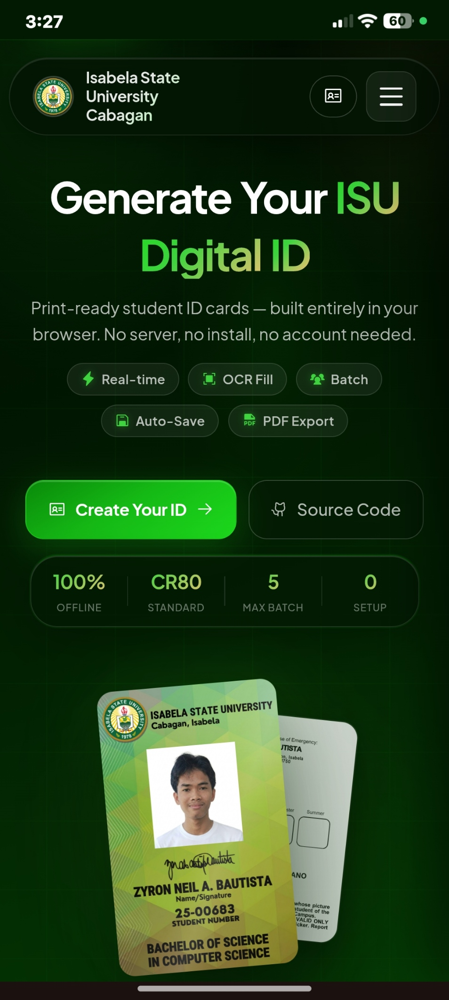

# 🎓 Isabela State University ID Generator v3.8.1

A premium, fully responsive **client-side** web application for generating high-fidelity, print-ready student identification cards for **all 11 Isabela State University (ISU) campuses**. Built with a stunning glassmorphism UI, interactive 3D card preview, multi-campus theme engine, security hologram overlays, real-time QR verification, and a powerful batch export studio — no backend, no build tools, runs entirely in the browser.

🔗 **Live Demo Git Page**: [https://zyronneil2007.github.io/Isabela-State-University_Cabagan/](https://zyronneil2007.github.io/Isabela-State-University_Cabagan/)<br>
🔗 **Live Demo (Vercel)**: [isabela-state-university-cabagan.vercel.app](https://isabela-state-university-cabagan.vercel.app)<br>
🔗 **Live Demo (Netlify)**: [idgenratorisuc.netlify.app](https://idgenratorisuc.netlify.app)

---

## 📸 Screenshots & Demo

> A visual walkthrough of the application's key interfaces and interactive components.

| Desktop Hero | Mobile Hero |
|---|---|
|  |  |

| Feature | Preview |
|---|---|
| **3D Card Tilt & VanillaTilt Hover** |  |
| **Bento Grid Feature UI** |  |
| **Glassmorphic Batch Data Manager** |  |

> 💡 **Tip:** Replace the placeholder links above with actual GIF/screenshot URLs after recording your demo. Tools like [LICEcap](https://www.cockos.com/licecap/) or [ScreenToGif](https://www.screentogif.com/) are recommended for capturing the 3D tilt animation.

---

## ✨ Features

### 🆕 v3.6 — University Multi-Campus & Security Studio Edition
- **🏛️ All 11 ISU Campus Themes**: Instant theme switching across all 11 ISU campuses (Cabagan, Echague, Cauayan, Ilagan, Roxas, Angadanan, San Mateo, Jones, Palanan, San Mariano, Santiago City). Propagates accent colors to UI buttons, live canvas graphics, and WebGL Three.js hero particles.
- **📱 Real-Time Verification QR Code**: Renders a dynamic, scannable QR Code (`ISU-VERIFY:[ID]:[NAME]`) on the card back for instant campus gate verification.
- **🛡️ Holographic Security Watermark**: Interactive toggle for ISU Seal watermark, UV guilloche security curves, and iridescent ribbon sheen reflection.
- **📊 Glassmorphic Batch Data Manager**: Table modal with student photo/signature completeness badges, real-time search, batch deletion, and CSV re-export.
- **🔍 High-Res 3D Card Inspector Studio**: Full-screen 300 DPI canvas inspection modal for front and back faces.
- **🔊 Web Audio API Sound FX**: Native Web Audio API sound cues for card flips, tab switching, and batch export chimes with an instant mute toggle.

### 🆕 v3.5 — Bento Grid & Spatial Motion Overhaul
- **🎨 Immersive Spatial Redesign**: Split-screen hero layout, animated 6-card Bento Grid for features, and a guided 3-step process.
- **🚀 Advanced GSAP & Three.js Animations**: Particle constellation background in the hero section and holographic shimmer effects on the live card stage.

### 🆕 v3.4 — Session Auto-Save & OCR Autofill
- **💾 Auto-Save Session**: Auto-saves your entire session (all students, form data, photos, signatures) to `localStorage` after every change.
- **🔍 OCR Autofill from Photo**: Snap or upload a photo of any printed ID or registration form. Powered by **Tesseract.js** (offline WASM), extracts Name, ID Number, Course, and DOB automatically.

### 🆕 v3.3 — Local Signature Scanner & Extractor
- **🪄 Local Signature Extraction (No APIs)**: Otsu binarization and automatic bounding-box cropping strip paper shadows and convert handwritten paper signatures to clean, transparent ink.

### 🆕 v3.2 — CSV Bulk Import & Unlimited Batches
- **📥 CSV Bulk Student Import**: Upload a `.csv` file containing 50+ students to auto-generate all ID cards in one click with smart header mapping.

### 🆕 v3.1 — Native A4 Landscape PDF Export
- **📄 Native A4 Landscape PDF Export**: Arranges up to 5 student pairs (10 cards total) per sheet in side-by-side front/back stacked rows for easy double-sided printing.

---

## 🛠️ Tech Stack

| Layer | Technology |
|---|---|
| Structure | Semantic HTML5 (ARIA roles, keyboard navigation) |
| Styling | Vanilla CSS3 (custom properties, GPU transforms, glassmorphism) |
| Logic | Vanilla ES6+ JavaScript (Canvas API, jsPDF, FileReader) |
| 3D / Graphics | [Three.js r134](https://threejs.org/), [VanillaTilt.js](https://micku7zu.github.io/vanilla-tilt.js/) |
| Animations | [GSAP 3](https://greensock.com/gsap/) + ScrollTrigger, [Anime.js v4](https://animejs.com/) |
| OCR | [Tesseract.js v5](https://tesseract.projectnaptha.com/) (offline WASM) |
| Icons & Fonts | [Phosphor Icons](https://phosphoricons.com/), Google Fonts (Plus Jakarta Sans, Roboto Condensed) |

---

## 📂 Project Structure

```text
isu_id/
├── web/                    # Client-side Web Application
│   ├── index.html          # Main HTML entry point
│   ├── style.css           # Glassmorphism design system & styles
│   ├── app.js              # Application core logic & Canvas rendering engine
│   ├── animations.js       # GSAP, Anime.js & Three.js animations
│   ├── images/             # Blank ID templates, logos & static assets
│   └── scripts/            # Python utility scripts:
│                           #   • dummy_data_generator.py — generates realistic
│                           #     fake student CSV datasets for batch import testing
│                           #   • photo_resizer.py — batch-resizes and crops student
│                           #     photos to the correct 315×355px canvas ratio
│
├── android/                # Android Application (Native Jetpack Compose / WebView Shell)
│   ├── app/                # Android app module (Kotlin source, assets, resources)
│   ├── gradle/             # Gradle wrapper
│   ├── build.gradle.kts    # Top-level build configuration
│   ├── settings.gradle.kts # Gradle project settings
│   ├── gradlew / gradlew.bat
│   └── gradle.properties
│
├── wiki/                   # Technical documentation and guides
├── README.md               # Project documentation
├── release_notes.md        # Release notes
└── .gitignore
```

---

## 🚀 Getting Started

### ✅ Prerequisites

Before running the project locally, ensure you have the following:

- **Modern Web Browser** — Chrome 90+, Firefox 88+, Edge 90+, or Safari 15+ (required for `OffscreenCanvas`, `CSS backdrop-filter`, and Web Audio API support).
- **Local HTTP Server** *(Optional but recommended)* — Required to avoid `file://` protocol CORS restrictions when Tesseract.js loads its WASM worker. Use one of:
  - `npx serve` (requires [Node.js](https://nodejs.org/) v16+)
  - `python -m http.server` (requires Python 3.x)
- **Android Studio** *(Android only)* — Arctic Fox (2020.3.1) or later, with the Android SDK targeting API 24+ (Android 7.0 Nougat).
- **Python 3.x** *(Optional, for `scripts/`)* — Only needed if you intend to run the dummy data generator or photo resizer utility scripts.

### 🌐 Web Application
1. Open [`web/index.html`](web/index.html) directly in any modern web browser.
2. *Optional (Local Server):*
   ```bash
   cd web
   npx serve .
   # or
   python -m http.server 8000
   ```

### 📱 Android Application
1. Open the `android/` directory in Android Studio.
2. Sync Gradle and run the app on an Android device or emulator (Android 7.0+ / API 24+).

---

## 📖 Quick Start Guide

### 🔍 Using OCR Autofill

Automatically populate the student form from a photo of any printed ID or registration slip in 3 steps:

1. **Upload the Source Document** — In the student form, click the **"OCR Autofill"** button and select (or snap) a photo of the printed ID card or enrollment form. Supported formats: JPEG, PNG, WEBP.
2. **Tesseract.js Scans Offline** — The app runs Tesseract.js v5 entirely in-browser via WebAssembly. No data is transmitted to any server. A progress indicator displays the recognition confidence in real time.
3. **Review, Edit & Apply** — The extracted fields (Name, ID Number, Course, Date of Birth) are displayed in a review panel *before* being committed to the form. Correct any OCR errors, then click **"Apply to Form"** to auto-fill all matched fields instantly.

> **Note:** OCR accuracy is significantly improved with high-contrast, well-lit photos. Avoid glare, shadows, and extreme angles when capturing the source document.

---

### 🖨️ Printing Tips

> [!IMPORTANT]
> **For best print results on A4 PDF exports, follow these settings:**
>
> - **Scale**: Set your printer's page scaling to **"Actual Size" (100%)** — never "Fit to Page", as this will shrink the CR80 card dimensions below the 85.6 × 54 mm standard.
> - **Double-Sided Printing**: Enable **"Flip on Long Edge"** (portrait duplex) in your printer's settings to correctly align front and back faces when cutting.
> - **Paper**: Use **160–200 gsm matte or glossy cardstock** for a premium, durable finish closest to the CR80 PVC standard.
> - **Cut Guides**: The exported PDF includes dashed cut-guide lines at exact CR80 boundaries — use a guillotine paper cutter for clean, precise edges.

---

## 📋 Changelog

### v3.8.1 *(2026-09-14)*
- `perf` — **Eliminated Scroll Repaint Bottleneck**: Removed `background-attachment: fixed` from `body` and moved the complex layered radial gradient to a `body::before` pseudo-element with `position: fixed; inset: 0; z-index: -1`. Background is now painted once into a dedicated compositor layer, resolving document-wide repainting on every scroll pixel.
- `perf` — **Eliminated Expensive GPU Blur Kernels**: Removed `filter: blur(80px)` from `.orb` elements. Decorative orbs utilize native `radial-gradient(..., transparent)` for soft diffusion with zero blur shader math overhead.
- `perf` — **Reduced Ambient Hero Glow Blurs**: Scaled down `.hero-glow-primary` filter blur from 60px to 30px, and `.hero-glow-gold` from 80px to 40px to free up GPU rendering capacity.
- `perf` — **Mobile GPU Optimization (`@media max-width: 860px`)**: Disabled expensive `backdrop-filter` calculations across all glass panels, form groups, liquid glass navbar/footer elements, badges, buttons, and modals on mobile/tablet viewports (≤860px). Provided solid semi-opaque dark fallbacks for crystal-clear readability and zero-stutter scrolling.
- `perf` — **Mobile Visual Cleanup**: Hidden decorative `.floating-orbs` and hero glows on mobile devices to eliminate unnecessary off-screen compositing overhead.
- `pwa` — Bumped Service Worker cache to `isu-id-v3.8.1` with updated precache asset references.
- `android` — Synchronized performance-optimized stylesheet to Android assets (`android/app/src/main/assets/www/style.css`), bumped `versionCode` to `4` and `versionName` to `3.8.1`.

### v3.8.0 *(2026-09-13)*
- `ui` — Removed hero section background watermark logo (`.hero-seal`) for a cleaner, distraction-free landing.
- `ui` — Removed hero eyebrow version badge (`.hero-badge`) to simplify the hero heading area.
- `perf` — Stopped all background CSS animations in the hero (mesh drift, ambient glow breath, floating orbs) — hero elements are now fully static, reducing CPU/GPU idle load.
- `perf` — Disabled Three.js WebGL particle constellation canvas (`#hero-webgl-canvas`) — the canvas is now hidden to eliminate the main-thread 60fps render loop on page load.
- `perf` — Removed GSAP scroll parallax on hero glows/orbs and hero seal — ScrollTrigger no longer attaches redundant scroll listeners for removed elements.
- `perf` — Canvas resize guard in `renderCanvases()`: only reassigns canvas dimensions when they actually change, preventing unnecessary GPU buffer discards on every render call.
- `perf` — Mini canvas (mobile stepper header) now also benefits from dimension change guard.
- `perf` — QR Code rendering now uses a memoized offscreen cache (`_qrCache`) — avoids DOM reflows and repeated encoding when the QR payload and size are unchanged.
- `pwa` — Added `manifest.webmanifest` (PWA web app manifest) with standalone display, theme color, and icon definitions for 256px and 512px ISU logos.
- `pwa` — Added `sw.js` Service Worker with stale-while-revalidate caching strategy for offline-first instant loading.
- `pwa` — Registered service worker in `web/index.html` inline script on `window.load`.
- `fix` — Holographic shimmer canvas now pauses its rAF loop when the browser tab is hidden (`document.hidden`) and resumes on `visibilitychange`, preventing wasted GPU work in background tabs.
- `fix` — Removed `QRCode.js` script tag from `web/index.html` and inline QR call from `renderCanvases()` — QR rendering is handled by the dedicated `renderQrCodeOnCanvas()` function only.
- `fix` — Document fonts: re-render canvases after `document.fonts.ready` resolves to prevent font-swap layout shifts on initial load.
- `sec` — Added SHA-384 Subresource Integrity hashes to GSAP, GSAP ScrollTrigger, Anime.js, and jsPDF CDN `<script>` tags.
- `sec` — All CDN scripts marked `defer` for non-blocking parallel loading.
- `dx` — Logo images across navbar, mobile drawer, footer, and Android asset references updated from `isu_logo.png` to the optimised `isu_logo_256.png` (navbar/mobile/footer-small) and `isu_logo_512.png` (footer-brand) with explicit `width`, `height`, and `decoding="async"` attributes for CLS prevention.
- `dx` — Removed scroll progress bar (`#scroll-progress`) element, its CSS, and JavaScript — simplified both HTML and animation layer.
- `android` — `versionCode` bumped from 2 to 3, `versionName` from `3.7.0` to `3.8.0`.
- `refactor` — Separated the repository into a monorepo structure: `web/` for the client-side web application and `android/` for the Android Studio project.
- `chore` — Updated `.gitignore` with comprehensive patterns for both `web/` and `android/` build artifacts.
- `docs` — Updated `README.md`, `wiki/Architecture.md`, and `wiki/Setup_and_Usage.md` to document the new folder structure and running instructions for both platforms.

### v3.6.0 *(2026-07-25)*
- `feat` — Multi-Campus Theme Selector supporting all 11 ISU campuses (Cabagan, Echague, Cauayan, Ilagan, Roxas, Angadanan, San Mateo, Jones, Palanan, San Mariano, Santiago City).
- `feat` — Real-Time Verification QR Code Generator for ID card back.
- `feat` — Holographic Security Watermark Overlay with UV guilloche curves and iridescent sheen.
- `feat` — Glassmorphism Batch Student Data Manager Modal with search, status badges, and CSV export.
- `feat` — High-Resolution 3D Card Inspector Studio modal.
- `feat` — Web Audio API synthesized sound effects with mute toggle.
- `fix` — Fully resolved all 14 outstanding bugs/UX issues from `issues.txt`.

### v3.4.3 *(2026-07-08)*
- `fix` — Corrected formatting and alignment issues in the module directory index within the main application script (`app.js`).
- `fix` — Standardized documentation and sequence ordering for secondary logical layers.

### v3.4.2 *(2026-06-28)*
- `fix` — Resolved 14 critical issues spanning bugs, UI desyncs, and edge-case exceptions.
- `fix` — Corrected activeStudentIndex mutation error when PDF exports fail midway.
- `fix` — Replaced obtrusive `alert()` dialogs in CSV import with native glassmorphism toast notifications.
- `perf` — Upgraded session `localStorage` to check file quota and prevent browser crash limits.
- `sec` — Secured Tesseract.js WASM imports by pinning CDN to v5.1.1 and adding SHA-384 Subresource Integrity hashes.

### v3.4.1 *(2026-06-26)*
- `fix` — Fixed hero stage card clipping on mobile viewports by enabling visible overflow and percentage-based transforms.
- `fix` — Reorganized mobile hero CTA buttons into a full-width stacked column for easier tap targets.
- `fix` — Improved version badge wrapping and tightened vertical rhythm across the hero section.
- `fix` — Added cache buster query parameter to `style.css` to ensure immediate delivery of UI updates.

### v3.4.0 *(2026-06-24)*
- `feat` — Auto-save session to `localStorage` on every render; restore banner on next page load.
- `feat` — OCR Autofill from a printed ID or registration form photo using Tesseract.js (local WASM, no server).
- `feat` — Smart regex field parser: extracts Name, ID Number, Course, and DOB from raw OCR text.
- `feat` — Cinematic hero redesign with spatial mesh grid layout and morphing ambient glows.
- `perf` — Significant performance tuning: debounced canvas rendering, throttled localStorage saves, lazy-loaded Tesseract.js, and strict CSS `contain` isolation.
- `ux` — Applied results review step in OCR modal before committing to the form; "Apply to Form" only shows post-scan.
- `ux` — Session restore banner slides in with a spring animation; dismissed silently if session is empty.

### v3.3.2 *(2026-06-24)*
- `fix` — Dynamically centers the cards on the A4 page for incomplete batches (e.g., exactly 1 student or 4 students).

### v3.3.1 *(2026-06-24)*
- `feat` — Redesigned print batch PDF layout to A4 Landscape, fitting up to 5 student card pairs (Front + Back) per page side-by-side.

### v3.3.0 *(2026-06-24)*
- `feat` — Added 100% client-side Local Signature Scanner/Extractor (no external APIs, offline-compatible).
- `feat` — Implemented Otsu's Binarization algorithm for adaptive paper thresholding (shadow and grey background removal).
- `feat` — Implemented automatic content bounding-box detection (autocrop) to trim paper margins.
- `ui` — Designed glass tab toggles to switch between draw and upload signature modes.

### v3.2.0 *(2026-06-24)*
- `feat` — Added client-side CSV bulk student import to support generating large batches of ID cards.
- `feat` — Bypassed manual batch limit (5) for CSV uploads, enabling infinite student batches.
- `feat` — Automated fuzzy column header mapping for Name, ID, Course, DOB, Parent/Guardian, Address, and Telephone.

### v3.1.0 *(2026-06-23)*
- `feat` — Completely redesigned Hero section with split-screen layout, floating 3D cards, and animated particles.
- `feat` — Converted A4 print export from PNG to an actual PDF using `jsPDF`.
- `feat` — ID cards strictly conform to standard CR80 (85.6mm x 54mm) size upon export.
- `ui` — Mobile hero and feature-pills refined for maximum visual appeal on small screens.

### v3.0.0 *(2026-06-22)*
- `feat` — Multi-student tab system (up to 5 students) with independent state per tab
- `feat` — Interactive photo cropper modal with pan/zoom and 315:355 aspect ratio lock
- `feat` — Dynamic A4 batch export engine: 1–5 student grid with cut guides & page header
- `feat` — Desktop export actions panel + mobile bottom sheet for Save Image / Print Batch
- `fix` — Repaired corrupted CSS that broke photo preview and live badge styling
- `fix` — Footer layout: removed `100vw` negative-margin hack causing horizontal scrollbar on Windows
- `fix` — Mobile export sheet visibility (no longer bleeds into page layout)
- `fix` — Desktop export actions correctly hidden on mobile, restored at 900px+

### v2.0.0
- Premium glassmorphism redesign with multi-tier glass panels
- 9-step stepper form with mini live card preview in header
- VanillaTilt 3D hover effect on card preview
- Digital signature pad (HTML5 Canvas)
- A4 print export with front + back dual-card layout

### v1.0.0
- Initial ISU ID generator — single student, basic form, canvas render

---

## 🤝 Contributing

Contributions, bug reports, and feature suggestions are warmly welcome from fellow developers and ISU community members. Here's how to get involved:

1. **Fork the repository** — Click **Fork** at the top of the [GitHub repo](https://github.com/ZyronNeil2007/Isabela-State-University_Cabagan) to create your own copy.
2. **Create a feature branch** — Use a descriptive branch name that reflects your change:
   ```bash
   git checkout -b feat/your-feature-name
   ```
3. **Make your changes** — Follow the existing code style. Keep commits atomic and write clear, imperative commit messages (e.g., `feat: add Echague campus theme override`).
4. **Test across browsers** — Verify your changes in at least Chrome and Firefox before submitting.
5. **Open a Pull Request** — Push your branch and open a PR against `main`. Provide a clear description of *what* you changed and *why*. Reference any related issue numbers.
6. **Report Bugs** — Use the [GitHub Issues](https://github.com/ZyronNeil2007/Isabela-State-University_Cabagan/issues) tracker. Include your browser version, OS, and steps to reproduce the issue.

> [!NOTE]
> This project has no external build step — all source files are plain HTML, CSS, and JavaScript. You can open `web/index.html` directly to test any changes instantly.

---

## 📬 Contact

Created, designed, and developed by **Zyron Neil**.

| Platform | Link |
|---|---|
| 🐙 GitHub | [github.com/ZyronNeil2007](https://github.com/ZyronNeil2007) |
| 💼 LinkedIn | [www.linkedin.com/in/neil-bautista-8656b4362](www.linkedin.com/in/neil-bautista-8656b4362) |
| 🌐 Portfolio | [your-portfolio.dev](https://your-portfolio.dev)|

Feel free to reach out for collaborations, campus deployment inquiries, or feature requests specific to ISU academic workflows.

---

## 🧑‍💻 Credits & License

Created, designed, and developed by **Zyron Neil**.

---
© 2026 Zyron Neil. All rights reserved.
